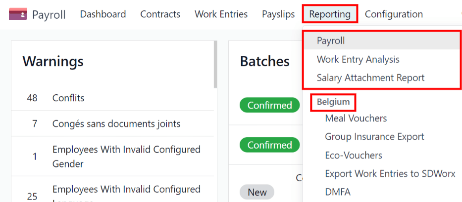
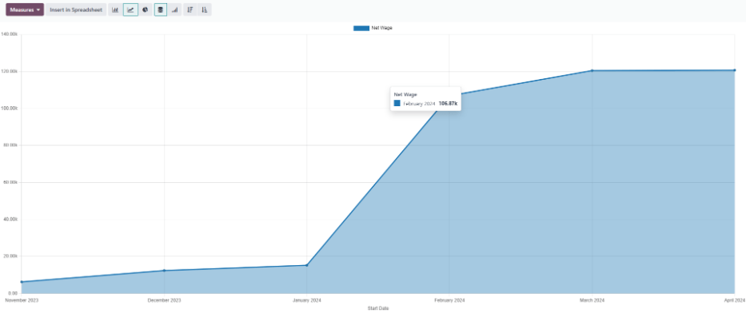
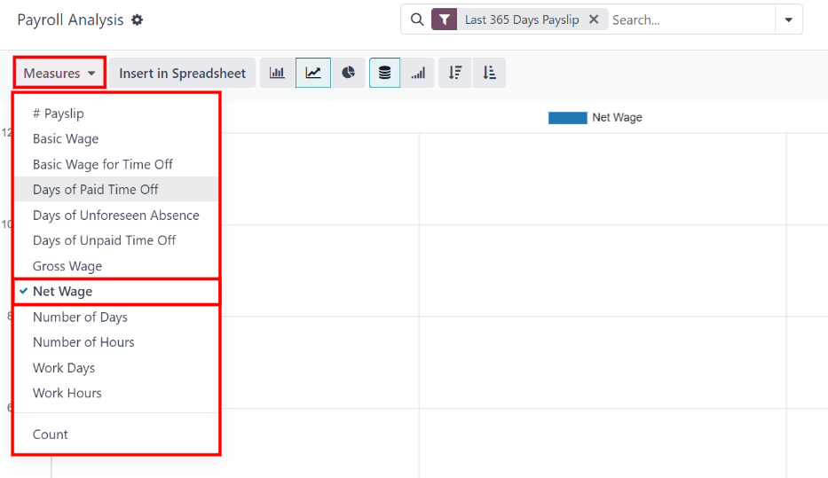
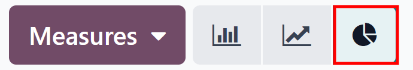
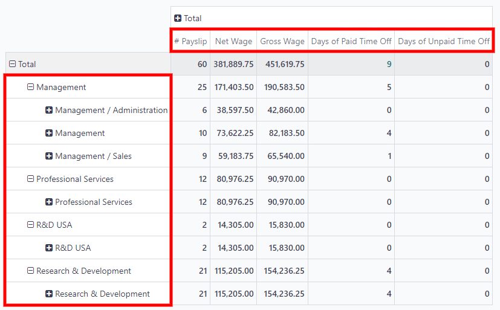
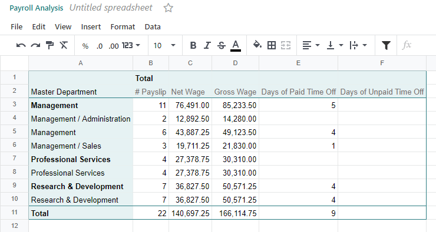
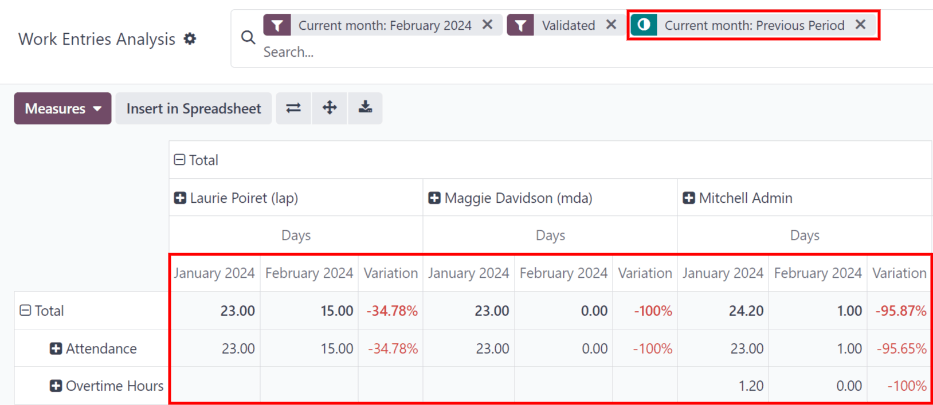
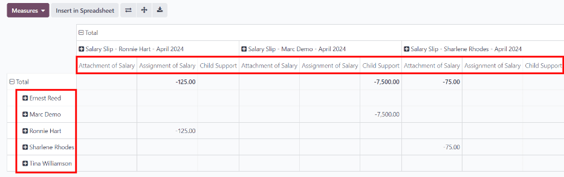
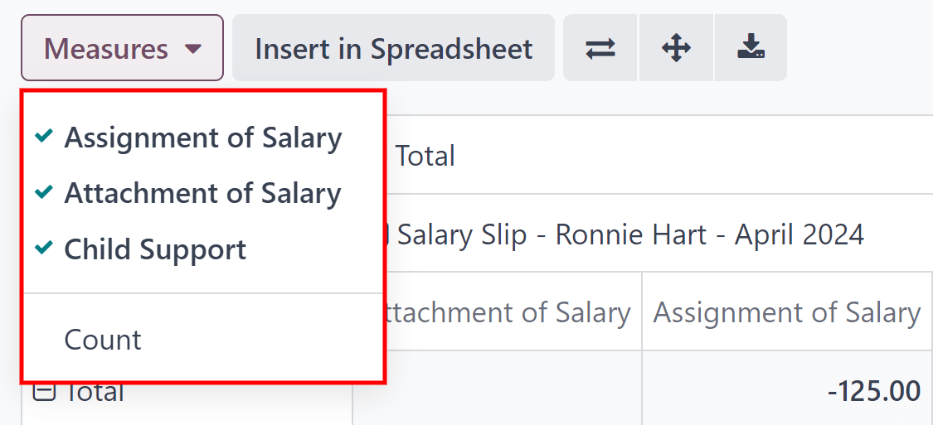

=========
Reporting
=========

The :guilabel:`Reporting` section of the *Payroll* app offers a variety of reports to choose from,
organized by location.

The *Payroll* report, *Work Entry Analysis* report, and *Salary Attachment Report* are default
reports in the *Payroll* app, and are available for all companies, regardless of location.

Beneath the three default reports are all localization-based reports, organized by country, in
alphabetical order. These reports contain all the various information for the offered benefits and
local tax laws.

To view all the available reports for the database, including all the localization-specific ones,
navigate to :menuselection:`Payroll app --> Reporting` to view the available reports. Click on a
specific report to view it.

If a report is unavailable to a user, an :guilabel:`Invalid Operation` pop-up window appears,
stating: `You must be logged in to a (country) company to use this feature.`

Filters
=======

At the top of each report, the default filters are shown inside the :guilabel:`Search` box.

Click the :guilabel:`drop-down arrow` in the search box to display the available
:guilabel:`filters`. Filters show information that matches the specific filter parameters.

.. example::
   The :guilabel:`Work Entries Analysis` report has two default filters, the :guilabel:`Current
   month:(Month)(Year)` filter, and the :guilabel:`Validated` filter. The :guilabel:`Payroll` report
   only has one default filter, the :guilabel:`Last 365 Days Payslip` filter.

   .. image:: reporting/custom-filter.png
      :align: center
      :alt: Filters enabled for the Work Entries Analysis report.

All reports can add custom filters, or group the information by different metrics (employee,
department, company, etc.). Some reports have the option to compare the current report to the
previous time period or year (a :guilabel:`Comparison` option).

Click on a parameter to select it and activate it. The report is immediately updated with the new
parameters.

The updated report can be set as a favorite report, meaning the parameters are stored for quick
access in the future. First, click :guilabel:`Save the current search` under the
:guilabel:`Favorites` section, and two options and a :guilabel:`Save` button appear.

If the current report is desired to be the default when the report is accessed, check the box next
to :guilabel:`Default filter`. If the current report should be accessible to everyone in the
database, check the box next to :guilabel:`Share`.

Finally, click :guilabel:`Save`, which saves the currently configured report, and it now appears
beneath :guilabel:`Favorites`.

Default reports
===============

Payroll
-------

Click on :menuselection:`Payroll app --> Reporting --> Payroll` to display the :guilabel:`Payroll
Analysis` report. This report shows all the payslips generated in the last 365 days.

The report can display metrics for a variety of parameters. Click the :guilabel:`Measures` box to
view a drop-down menu with the various options to display.

The default options available include: :guilabel:`# Payslip`, :guilabel:`Basic Wage`,
:guilabel:`Basic Wage for Time Off`, :guilabel:`Days of Paid Time Off`, :guilabel:`Days of
Unforeseen Absence`, :guilabel:`Days of Unpaid Time Off`, :guilabel:`Gross Wage`, :guilabel:`Net
Wage`, :guilabel:`Number of Days`, :guilabel:`Number of Hours`, :guilabel:`Work Days`,
:guilabel:`Work Hours`, and :guilabel:`Count`.

:guilabel:`Net Wage` is the default metric for the :guilabel:`Payroll` report.

Line chart
~~~~~~~~~~

A line chart is the default view for the *Payroll* report. If a different view is selected, click
the :guilabel:`Line Chart` icon in the menu bar to change the view back to a line chart.

Several options are available for the line chart. Click the corresponding button to activate the
selection, and change the way the data is presented.

The various options are: :guilabel:`Stacked`, :guilabel:`Cumulative`, or in :guilabel:`Descending`
or :guilabel:`Ascending` order. These icons appear at the end of the chart options.

.. image:: reporting/line-chart.png
   :align: center
   :alt: Menu buttons with the line chart called out, along with the other option buttons.

Bar chart
~~~~~~~~~

To display the data in a bar chart, click on the :guilabel:`Bar Chart` icon in the menu bar.

Click the :guilabel:`Stacked` icon to view the bar chart in a stacked format (where multiple values
appear in each column). An option to display the columns in :guilabel:`Descending` or
:guilabel:`Ascending` order appears at the end of the options.

.. image:: reporting/bar-chart.png
   :align: center
   :alt: Menu buttons with the bar chart called out, along with the other option buttons.

.. tip::
   Clicking an option enables it. To turn off the option, click it again. When the option is enabled
   it appears gray. When it is inactive, it appears white.

Pie chart
~~~~~~~~~

To display the data in a pie chart, click on the :guilabel:`Pie Chart` icon in the menu bar. There
are no additional options available in this view.

Pivot table
~~~~~~~~~~~

To display the data in a pivot table, click on the :guilabel:`Pivot` icon located in the far-right
side of the top menu bar.

The default information displayed includes the number of payslips (:guilabel:`# Payslip`), the
:guilabel:`Net Wage`, the :guilabel:`Gross Wage`, the number of :guilabel:`Days of Paid Time Off`,
and the number of :guilabel:`Days of Unpaid Time Off`. The information is organized by department.

To display more information on the report, click the :guilabel:`Measures` button to reveal a
drop-down menu. Then, click on any other metric to display it.

To sort the entries by a specific column, such as :guilabel:`Net Wage`, click on the column name
twice. The first click selects the column, and the second click sorts the information in descending
order.

To export the data in an XLSX format, click the :guilabel:`Download xlsx` icon. The information is
then downloaded into a spreadsheet.

.. image:: reporting/xlsx.png
   :align: center
   :alt: The Download button highlighted.

Any report can be inserted into a spreadsheet by clicking the :guilabel:`Insert in Spreadsheet`
button. A :guilabel:`Select a spreadsheet to insert your (type of report)` pop-up window appears,
asking which spreadsheet to place the information in. Select an existing spreadsheet or dashboard,
or select a new :guilabel:`Blank spreadsheet`. Click the :guilabel:`Confirm` button to move to a
spreadsheet view with the report added to it.

.. note::
   The *Documents* application must be installed to use the :guilabel:`Insert in Spreadsheet`
   option.

Work entry analysis
-------------------

The default :guilabel:`Work entry analysis` report provides an overview of the validated work
entries for the current month. To view this report, navigate to :menuselection:`Payroll app -->
Reporting -> Work Entry Analysis`.

To change the displayed view, click the :guilabel:`➕ (plus)` icon next to the word
:guilabel:`Total`, then click on one of the grouping options. The available options are
:guilabel:`Work Entry Type`, :guilabel:`Employee`, and :guilabel:`Department`. If in a multi-company
database, a :guilabel:`Company` option also appears.

To add a new group to sort the data by, click :guilabel:`Add Custom Group`, then click one of the
presented options.

.. tip::
   Wherever a :guilabel:`➕ (plus)` icon appears on a pivot table, the information can be further
   grouped. Click on a :guilabel:`➕ (plus)` icon to reveal the available grouping options.

   Click on a :guilabel:`➖ (minus)` icon anywhere on the pivot table to remove that grouping.

It is possible to compare the current :guilabel:`Work entry analysis` report to the previous month
or the previous year. To view these comparisons, click the :guilabel:`drop-down arrow` in the search
bar to reveal the various filter and grouping options.

In the section titled :guilabel:`Comparison`, click on either :guilabel:`Current Month: Previous
Period` or :guilabel:`Current Month: Previous Year`. The report updates, and displays the previous
time period values, as well as the :guilabel:`Variation` between the two.

To export the data in an XLSX format, click the :guilabel:`Download xlsx` icon. The information is
downloaded into a spreadsheet.

The data can also be inserted into a spreadsheet. Click the :guilabel:`Insert in Spreadsheet` button
and a :guilabel:`Select a spreadsheet to insert your (type of report)` pop-up window appears, asking
which spreadsheet to place the information in. Select an existing spreadsheet or dashboard, or
select a new :guilabel:`Blank spreadsheet`. Click the :guilabel:`Confirm` button to move to a
spreadsheet view with the report added to it.

.. note::
   The *Documents* application must be installed to use the :guilabel:`Insert in Spreadsheet`
   option.

Salary attachment report
------------------------

The :guilabel:`Salary Attachment Report` shows all deductions or allocations per employee, such as
child support payments and wage garnishments. To view this report, navigate to
:menuselection:`Payroll app --> Reporting -> Salary Attachment Report`.

The employees are listed in the left-side column, while the different deductions are listed in the
top row, organized by deduction, and monthly individual payslips.

The report can be exported as a XLSX file, or inserted into a spreadsheet, using the corresponding
buttons at the top.

Click the :guilabel:`Measures` button to show the options on what data is displayed.
:guilabel:`Assignment of salary`, :guilabel:`Attachment of salary`, :guilabel:`Child support`, and
:guilabel:`Count` can all be selected or deselected by clicking on the item. If an item has a check
mark next to it, that information is displayed.

The :guilabel:`Salary Attachment Report` can be compared to the report for the previous time period
or the previous year. To view these comparisons, click the :guilabel:`drop-down arrow` in the search
bar to reveal the various filter and grouping options.

In the section titled :guilabel:`Comparison`, click on either :guilabel:`Payslip End Date: Previous
Period` or :guilabel:`Payslip End Date: Previous Year`. The report updates, and displays the
previous time period values, as well as the :guilabel:`Variation` between the two.
