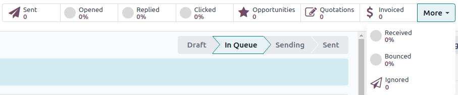

=============================
Lost leads reactivation email
=============================

In Odoo, marking a lead as lost is not the end of its journey. Lost leads are removed from the
active pipeline, but can still be targeted with the *Email Marketing* application for strategic
marketing campaigns like a lost leads reactivation email.

A lost leads reactivation email looks at the leads that were lost during a specific period of time,
and uses a few custom filters and lost reasons to exclude undesirable leads from the mailing list.

Once a lost leads reactivation email is complete, it can be sent as is, modified and sent to
different groups for A/B testing, or saved as a template for later.

.. example::
   A warehouse has leftover merchandise from a limited run of items from last year. To help clear
   out the inventory, the warehouse manager creates a lost leads email to reach out to old deals and
   inform them that the limited merchandise is back in stock.

   The warehouse manager uses the basic guidelines for a lost leads email, and then a series of lost
   reasons to exclude leads that were not interested in this specific merchandise.

   .. image:: lost_leads_email/example.png
      :align: center
      :alt: A lost leads reactivation filter list excluding lost reasons like Too Expensive.

.. tip::
   As filters are added and removed, pay attention to the :guilabel:`# record(s)` text below the
   filters. It indicates the total number of records that match the current criteria.

   To view a list of all matching records, click the :guilabel:`# record(s)` text.

   .. image:: lost_leads_email/records.png
      :align: center
      :alt: The # record(s) text is located below the list of Recipient filters.

.. _create_email:

Create a lost leads reactivation email
======================================

The basic elements of a lost leads reactivation mailing list include the following:

- A **Blacklist** filter to exclude unsubscribed recipients
- A **Created on** filter to target leads that were lost during a specific period of time
- Three **Stage** filters to exclude leads in the new, qualified, and won stages
- One or more **Lost Reason** filters to exclude undesired leads
- A pair of **Active** filters to target both active and inactive leads

**To create a lost leads reactivation email:**

1. Navigate to the *Email Marketing* app, and on the :guilabel:`Mailings` page, click
   :guilabel:`New` in the top-left.
2. Click the :guilabel:`Subject` field, and enter an appropriate subject line for the email.
3. Click the :guilabel:`Recipients` field, and select :guilabel:`Lead/Opportunity` from the drop-down
   menu.
4. Add a :guilabel:`Created on` rule to designate a specific time period during which the targeted
   leads were lost (30 days prior, 90 days prior, previous year, etc.):

   Click the :guilabel:`➡️ (right arrow)` icon below the :guilabel:`Recipients` field to open the
   filter rules. Leave the default :guilabel:`Blacklist` rule in place, and click :guilabel:`New
   Rule`.

   Click the new rule’s first field, and select :guilabel:`Created on` from the drop-down menu.
   Click the second field and select :guilabel:`<=`, :guilabel:`>=`, or :guilabel:`is between`, as
   needed. Click the third field, use the calendar pop-up to select dates, and click
   :guilabel:`Apply`.

   .. image:: lost_leads_email/created-on.png
      :align: center
      :alt: A custom filter rule setting the time period to be anything before today's date.

.. important::
   Make sure the statement at the top of :guilabel:`Recipients` filter list reads :guilabel:`Match
   all of the following rules`. If it does not, click on the statement, and select :guilabel:`all`
   from the drop-down menu.

   .. image:: lost_leads_email/match-all.png
      :align: center
      :alt: The statement at the top of the filters list, with the drop-down menu open.

5. Add :guilabel:`Stage` filters to exclude leads in the new, qualified, or won stages of the
   pipeline:

   Click :guilabel:`New Rule`. Click the rule’s first field, and select :guilabel:`Stage` from the
   drop-down menu. Click the second field, and select :guilabel:`does not contain`. Click the third
   field, and enter :guilabel:`new`.

   Click the :guilabel:`➕ (plus)` icon to the right of the rule to duplicate it. Click the new
   rule’s third field, delete :guilabel:`new`, and enter :guilabel:`qualified`. Click the
   :guilabel:`➕ (plus)` icon next to this rule to create another duplicate.

   Click the newest rule’s third field, delete :guilabel:`qualified`, and enter :guilabel:`won`.

   .. image:: lost_leads_email/stages.png
      :align: center
      :alt: Three filter rules requiring that the Stage does not contain New, Qualified, or Won.

6. Add one or more :guilabel:`Lost Reason` rules to exclude undesired leads:

   Click :guilabel:`New Rule`. Click the rule’s first field, and select :guilabel:`Lost Reason` from
   the drop-down menu. Click the rule’s second field, and select :guilabel:`does not contain` from
   the drop-down menu. Click the rule’s third field, and enter a lost reason to include.

   Repeat the preceding steps to add more lost reasons, as needed. For more information, refer to
   :ref:`select_lost_reasons`.

   .. image:: lost_leads_email/reasons.png
      :align: center
      :alt: A list of filter rules that exclude all lost reasons other than the desired reason.

7. Finally, add a pair of **Active** filters to include both active and inactive leads:

   Click the :guilabel:`Add Branch` icon to the right of the latest rule to add a pair of
   :guilabel:`match any of` rules. Click the first rule's first field, and select :guilabel:`Active`
   from the drop-down menu. The rule now reads :guilabel:`Active is set`.

   Click the second rule's first field, and once more select :guilabel:`Active` from the drop-down
   menu. Now click the rule’s third field, and select :guilabel:`not set` from the drop-down menu.

   .. image:: lost_leads_email/active.png
      :align: center
      :alt: A pair of Match Any Of filter rules that include both active and inactive leads.

8. Now create the body content of the email and adjust settings as needed. For more information,
   refer to :doc:`../email_marketing`.

.. tip::
   Consider using A/B Testing to send an alternate version of the email to a percentage of the
   target leads. This can help determine what subject lines and body content produce the best
   click-through rates before sending a final version to the remaining leads.

   To do so, open the :guilabel:`A/B Tests` tab and check the box next to :guilabel:`Allow A/B
   Testing`. Adjust the parameters as needed, and click :guilabel:`Create an Alternative Version`.

   .. image:: lost_leads_email/ab-testing.png
      :align: center
      :alt: The A/B Tests tab with the Allow A/B Testing box checked to create an alternate version.

9. Once the email is complete:

   - to immediately send the email, click :guilabel:`Send`.

     OR
   - to schedule a future date and time for the email to be sent, click :guilabel:`Schedule`.

.. tip::
   To save this set of filters for later use, click :guilabel:`Save as Favorite Filter`, enter a
   name (such as *Lost Leads*), and click :guilabel:`Add`.

   .. image:: lost_leads_email/favorite.png
      :align: center
      :alt: The Save as Favorite Filter pop-up can save the lost leads criteria for later.

.. _select_lost_reasons:

Select appropriate lost reasons
-------------------------------

When a lead is marked as lost, Odoo recommends selecting a *Lost Reason* to indicate why the
opportunity did not result in a sale. Doing so establishes potential opportunities to follow up with
the lead in the future.

If an existing reason is not applicable, users can create new ones, which means the lost reasons in
a database vary from organization to organization and pipeline to pipeline. For more information,
refer to :doc:`../../sales/crm/pipeline/lost_opportunities`.

By default, Odoo does include a few common reasons such as:

- *Too expensive*
- *We don't have people/skills*
- *Not enough stock*

When determining which reasons to include in a lost leads reactivation email, consider what the
email is advertising to pinpoint one or more relevant lost reasons. Then add a rule stating
:guilabel:`Lost Reason does not contain _____` for every reason in the database **except** for the
relevant ones.

.. example::
   If the email advertises a selection of previously limited merchandise that is now back in stock,
   it makes sense to target leads with the lost reason: *not enough stock*. To do so, add rules that
   exclude all reasons except *not enough stock*.

   .. image:: lost_leads_email/out-of-stock.png
      :align: center
      :alt: A list of filter rules that exclude all lost reasons except for Out of Stock.

   If the email advertises a price reduction, it makes sense to target leads with the lost reason:
   *too expensive*. To do so, add rules that exclude all reasons except *too expensive*.

   .. image:: lost_leads_email/too-expensive.png
      :align: center
      :alt: A list of filter rules that exclude all lost reasons except for Too Expensive.

.. _analyze_results:

Analyze the results
===================

After sending a lost leads reactivation email, marketing teams can use the smart buttons along the
top of the email to analyze the results and determine follow up actions.

Clicking on any of the smart buttons opens a list of the records matching that button's criteria
(see below).

The smart buttons include:

- :guilabel:`Sent:` the total number of emails that were sent.
- :guilabel:`Opened:` the percentage of recipients that opened the email.
- :guilabel:`Replied:` the percentage of recipients that replied to the email.
- :guilabel:`Clicked:` the percentage of recipients that clicked on a link in the email.
- :guilabel:`Opportunities:` the number of opportunities that have been created as a result of the
  email.
- :guilabel:`Quotations:` the number of quotations that have been created as a result of the email.
- :guilabel:`Invoiced:` the number of invoices that have been created as a result of the email.
- :guilabel:`Received:` the percentage of recipients that received the email.
- :guilabel:`Bounced:` the percentage of recipients that received the email.
- :guilabel:`Ignored:` the number of recipients that received the email but have not interacted with
  it.

Email nurturing
---------------

*Email nurturing* (sometimes referred to as *lead nurturing*) is the process of sending a series of
timely and relevant emails to connect with a lead, build a deeper relationship, and ultimately
convert the lead into an invoiced sale.

The point of nurturing is to keep the email campaign "visible" or at the top of a lead's inbox until
they are ready to buy. There are many approaches to effective nurturing, but it often involves:

- sending an initial email (such as a lost leads reactivation email)
- sending a follow up email each week (or according to specific triggers) the duration of the
  campaign
- continuously analyzing the results to see what approaches have resulted in sales
- continuously adjusting the approach to remain "visible" at the top of the lead's inbox, build a
  compelling narrative, and get a response from the lead

As a campaign progress, a marketing team may send different follow up emails depending on how a lead
responded the previous week.

.. example::
   A marketing team wants to advertise a re-stock of limited run merchandise to all leads with a
   lost reason of *not enough stock*. They develop the following three-week long campaign.

   - **Week 1:** the marketing team sends an initial email with a subject line of *“Limited run
     merchandise is back in stock! Act now!”*
   - **Week 2:** the marketing team sends two different emails, depending on how a lead responded.

     - If a lead ignored the Week 1 email: *“Stock is almost out, did you get yours?”*
     - If a lead clicked on the Week 1 email: *"You still have time to add this to your collection"*
   - **Week 3:** the marketing team sends a final email to all leads who have not been converted
     stating *“20% off, don't miss your last chance to get these items before they're gone!”*

   Throughout the campaign, the marketing team continuously refers to the smart buttons along the
   top of the mailing page to see what percentages of leads are opening, clicking on, or ignoring
   the emails, as well as to report on how many opportunities, quotations, and invoices have been
   generated by the campaign.

.. seealso::
   - :doc:`../email_marketing`
   - :doc:`mailing_lists`
   - :doc:`unsubscriptions`
