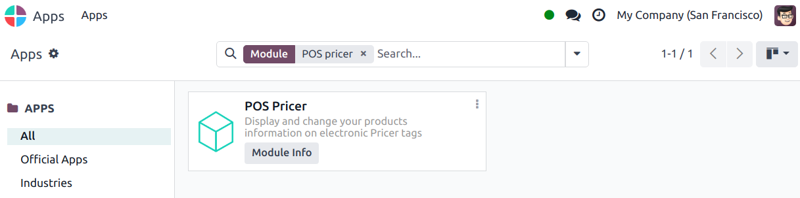
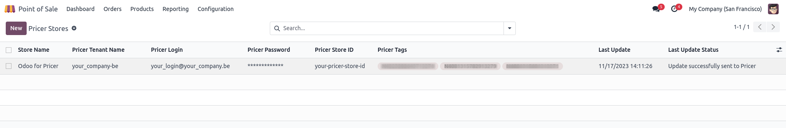
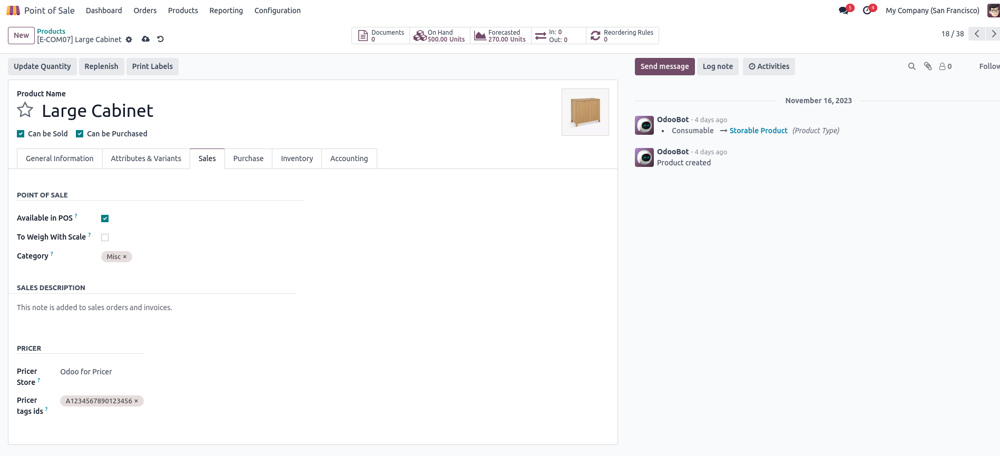
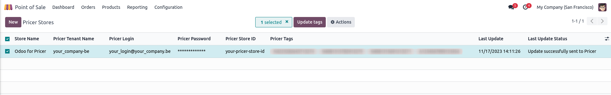
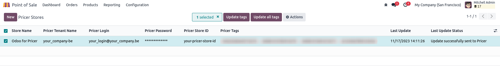

===========
Pricer tags
===========

Digital price tags are electronic shelf labels that display important product information like price
and barcode on store shelves. They can be updated remotely, eliminating the need for printing new
labels when product information changes.

.. note::
   Odoo uses price tags from `Pricer <https://www.pricer.com/>`_.

Configuration
=============

Pricer setup
------------

#. `Get in touch with Pricer <https://www.pricer.com/contact>`_ to create a Pricer account.
#. Configure your stores.

   .. note::
      When you configure a Pricer account, make sure you get the access to send requests to their
      API.

#. Create the following variables on Pricer to allow sharing information between Odoo and Pricer:

   - `itemId` : the internal id of your products
   - `itemName` : the name of your products
   - `price` : the price of your products including taxes, if any
   - `presentation`: the template name used for Pricer tags display
   - `currency` : the currency of your Odoo company
   - `barcode` : the barcode associated to your products, if any

   .. warning::
       The names for these variables must be **identical** in your Pricer database.

#. Configure a template used to display information on your digital tags.

   .. warning::
      In order to use Pricer with Odoo, make sure your template is named `NORMAL`.

Once your account, stores, variables, and your template are configured on Pricer, you can proceed to
the Odoo setup.

Odoo setup
----------

As a pre-requisite, :ref:`activate <general/install>` the `POS Pricer` module. Doing so adds the
required features to use Pricer electronic tags.

Once the module is activated, you need to configure your :ref:`pricer stores <pricer_tags/stores>`
and your :ref:`pricer tags <pricer_tags/tags>`.

.. _pricer_tags/stores:

Pricer stores
~~~~~~~~~~~~~

What is a pricer store??

Configure your Pricer stores by going to :menuselection:`Point of Sale --> Configuration
--> Pricer Stores`, clicking :guilabel:`New`, and filling in the lign with the required information.
Odoo will need the following information from Pricer to be able to communicate with your tags:

- :guilabel:`Store Name`:
- :guilabel:`Pricer Tenant Name`* : the name of your company account in Pricer, usually followed by
  `-country_code`
- :guilabel:`Pricer Login`* : the login of a Pricer account
- :guilabel:`Pricer Password`* : the password for the Pricer account above
- :guilabel:`Pricer Store ID`*: the id of a Pricer store as defined on your Pricer database
- :guilabel:`Pricer Tags`:

.. warning::
    The account associated to your Pricer store must have access to send API requests to Pricer.

.. _pricer_tags/tags:

Pricer tags
~~~~~~~~~~~

Go to :menuselection:`Point of Sale --> Products --> Products` and click :guilabel:`New` or
select an existing product.

.. warning::
    If you are creating a new product, make sure you configure and save it before associating
    any Pricer tags to it.

When your product has all the information you need, go to the :guilabel:`Sales` tab, scroll down to
the :guilabel:`Pricer` category, and select the Pricer store you configured in the previous step.

Once a product has a Pricer store associated to it, you will be able to link Pricer tags to it
by inputting their id's in the :guilabel:`Pricer tag ids` field.

.. note::
   Pricer tags ID: must be composed of a letter followed by 16 digits.

It is recommended to use a barcode scanner for this.

.. tip::
   When setting up Pricer with Odoo for the first time, it is recommended to configure only
   one product first. Make sure you are able to display its information on a Pricer tag before
   configuring the rest of them. If you can display a product's information on a Pricer tag, your
   configuration is done correctly.

Now that you have a product associated to a Pricer tag, we can send its information to Pricer

Displaying your product information on Pricer tags
--------------------------------------------------

When you associate a product to a Pricer tag in Odoo, the link request will not be sent straight away.

Every 12 hours Odoo will check if you have linked any new Pricer tags or updated some products information
with associated Pricer tags.

If so, Odoo will send a request to Pricer to link new Pricer tags or update the displayed information.

The whole process is done automatically to keep your products information syncrhonized in Odoo and on displays.

However, if you want to manually force the request at a given moment, you can go to
:menuselection:`Point of Sale --> Configuration --> Pricer --> Pricer Stores`, select the Pricer Store
you want to update and click on :guilabel:`Update tags`

Once a request has been sent to Pricer, you can see its time and status in under **Last Update** and **Last Update Status** fields
The **Last Update** and **Last Update Status** fields also allow you to track the time and status of automatic updates every 12 hours.

.. note::
   The request will only be sent to Pricer for products which have one of these fields modified since the last request:
   - Product Name
   - Product Price
   - Product Customer Taxes
   - Product barcode
   - Product currency
   - Associated Pricer Store
   - Associated Pricer tags
   If the product wasn't modified for one of these fields since the last request sent to Pricer, no new request will be sent for it

.. warning::
    If a request sent to Pricer failed, Odoo will still consider that the product has been updated,
    so no retry request will be sent for that product

If the request has been processed and accepted by Pricer, the status field will show **"Update successfully sent to Pricer"**
Otherwise, an error message will be shown.

.. tip::
   If for some reason your update requst failed despite a correct configuration or you want to make sure all the products are linked, you
   can go to :menuselection:`Point of Sale --> Configuration --> Pricer --> Pricer Stores`, select the desired Pricer stores and click on
   :guilabel:`Update all tags` button, which is only visible in :ref:`Developer Mode (debug mode) <developer-mode>`.

   This will send a request to Pricer to link and update **all** products associated to the selected Pricer stores.

.. note-to-self
   Pricer store (?): This product will be linked to and displayed on the Pricer tags of the store
   selected here
   On pricer tags ids (?): This product will be linked to and displayed on the Pricer tags with ids
   listed here. It is recommended to use a barcode scanner