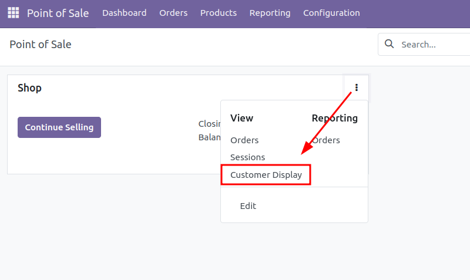

====================
PoS Customer Display
====================

The PoS Customer Display module allows you to display the current order to your customer in real time.

There are multiple ways in which you can configure the PoS Customer Display:

Local
=====

This is the default way and the simplest one. In order to use it, you need to have a second screen connected
to your PoS device. Simply click on the *Customer Display* icon and a new window will open showing the customer
display interface. You can drag this window to the second screen and set it to full screen.

Remote
======

This method allows you to display the PoS Customer Display on a remote screen. This screen does not have to
be connected in any way to the PoS device. In order to use this method, you need to have a second device.
This device can be a computer, a tablet or even a smartphone.

Both the PoS device and the second device need to be online, but not necessarily on the same network.

On the second device, access the remote screen interface from this menu:

Proxy
=====

This method allows you to display the PoS Customer Display on a monitor connected to the IoTBox.
This method is useful because it does not require an internet connection. The IoTBox and the PoS device will communicate on the
local network. Both devices need to be connected to the same local network.
